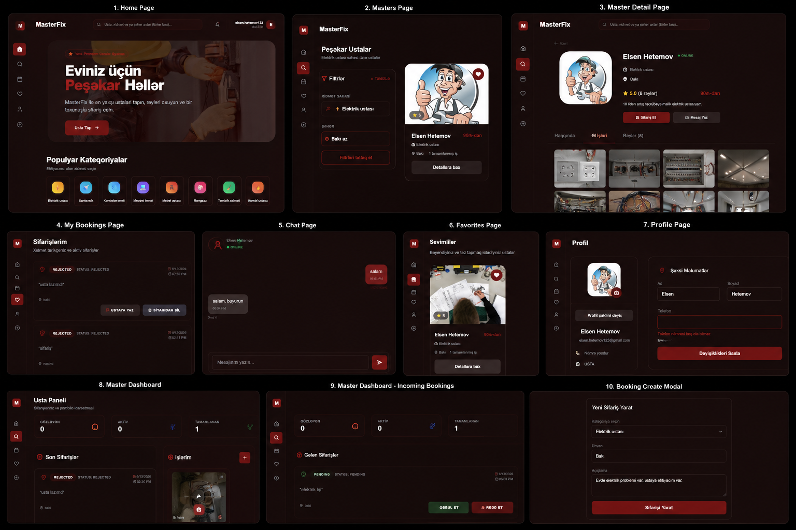

<p align="center">
  
</p>

# 🚀 MasterFix

### Professional Service Marketplace Platform

Java Spring Boot + React Full Stack Application

</div>

---

## 📖 Layihə Haqqında

MasterFix istifadəçilərin elektrik, santexnik, kondisioner, mebel, kompüter təmiri və digər xidmət sahələrində fəaliyyət göstərən ustaları asanlıqla tapmasına imkan verən müasir Full-Stack Marketplace platformasıdır.

Platforma müştərilər və peşəkar ustalar arasında əlaqə yaradır, sifarişlərin idarə edilməsini sadələşdirir və xidmət prosesini rəqəmsallaşdırır.

İstifadəçilər:

* Ustaları axtara bilər
* Kateqoriya və şəhər üzrə filtr edə bilər
* Sifariş yarada bilər
* Usta ilə mesajlaşa bilər
* Sevimlilərə əlavə edə bilər
* Xidmət tamamlandıqdan sonra rəy yaza bilər

Ustalar isə:

* Peşəkar profil yarada bilər
* Portfolio yükləyə bilər
* Gələn sifarişləri idarə edə bilər
* Müştərilərlə əlaqə saxlaya bilər

---

## ✨ Əsas Funksionallıqlar

### 🔐 Təhlükəsizlik və Autentifikasiya

* JWT Authentication
* Refresh Token
* Email Verification
* Forgot Password
* Reset Password
* Role-Based Authorization
* BCrypt Password Encryption

### 👨‍🔧 Usta İmkanları

* Usta profili yaratmaq
* Profil şəkli yükləmək
* Portfolio əlavə etmək
* Sifarişləri qəbul etmək
* Sifarişləri rədd etmək
* Xidməti tamamlanmış kimi işarələmək
* Müştəri ilə mesajlaşmaq

### 👤 Müştəri İmkanları

* Usta axtarmaq
* Kateqoriya üzrə filtr
* Şəhər üzrə filtr
* Sifariş yaratmaq
* Sifarişi ləğv etmək
* Sevimlilərə əlavə etmək
* Rəy yazmaq
* Sifariş tarixçəsinə baxmaq

### ⭐ Reytinq Sistemi

* Ulduz sistemi
* Müştəri rəyləri
* Orta reytinq hesablanması
* Tamamlanmış sifariş əsasında rəy yazılması

### 📁 Fayl İdarəetməsi

* Profil şəkli yükləmə
* Portfolio şəkilləri
* Fayl validasiyası
* Server üzərində saxlanma

---

## 🏗 Layihə Arxitekturası

Layihə N-Tier Architecture prinsipi ilə hazırlanıb.

```text
Controller
     ↓
Service
     ↓
Repository
     ↓
PostgreSQL
```

İstifadə olunan dizayn yanaşmaları:

* DTO Pattern
* Repository Pattern
* Service Layer Pattern
* JWT Security Pattern
* Dependency Injection

---

## 🛠 Backend Texnologiyaları

* Java 21
* Spring Boot
* Spring Security
* Spring Data JPA
* Hibernate
* PostgreSQL
* JWT
* Docker Compose
* Lombok
* Validation
* Java Mail Sender
* Swagger OpenAPI

---

## 🎨 Frontend Texnologiyaları

* React
* Vite
* React Router DOM
* Axios
* Tailwind CSS
* Lucide React

---

## 📊 Əsas Modullar

* Authentication Module
* User Module
* Master Module
* Category Module
* Booking Module
* Review Module
* Favorite Module
* Portfolio Module
* Messaging Module
* Email Verification Module
* Password Recovery Module

---

## 🔄 Sifariş Axını

```text
PENDING
   │
   ├──► ACCEPTED ───► COMPLETED
   │
   ├──► REJECTED
   │
   └──► CANCELLED
```
## 🌐 Demo

MasterFix platforması müştərilər və ustalar arasında sifariş, ünsiyyət və xidmət idarəetməsini rəqəmsallaşdıran full-stack marketplace həllidir.
## 📸 Platformaya Ümumi Baxış

<p align="center">
  
</p>

**Şəkildə göstərilən modullar:**

- 🏠 Ana Səhifə (Home)
- 👨‍🔧 Ustaların Siyahısı
- 📄 Usta Detalları
- 📅 Sifarişlərim
- 💬 Çat Sistemi
- ❤️ Sevimlilər
- 👤 Profil
- 🛠 Usta Paneli
- 📥 Gələn Sifarişlər
- ➕ Sifariş Yaratma Pəncərəsi

---

## 📂 Layihə Strukturu

```text
MasterFixApplication
│
├── src/main/java
│   ├── controller
│   ├── service
│   ├── repository
│   ├── entity
│   ├── dto
│   ├── security
│   ├── config
│   └── exception
│
├── src/main/resources
│
├── masterfix-frontend
│   ├── src
│   ├── components
│   ├── pages
│   ├── services
│   └── assets
│
└── screenshots
```

---

## 🚀 Gələcək İnkişaf Planları

* Admin Panel
* İstifadəçi İdarəetməsi
* Kateqoriya İdarəetməsi
* Statistika Paneli
* Real-Time Chat (WebSocket)
* Push Notifications
* Ödəniş Sistemi
* CI/CD Pipeline
* Docker Production Deployment

---

## 👨‍💻 Müəllif

**Mehriban Nüsrətova**

Java Backend Developer

📌 Java • Spring Boot • PostgreSQL • React

🔗 GitHub: [MehribanNusretova](https://github.com/MehribanNusretova)

## ⭐ Dəstək

Layihəni bəyəndinizsə GitHub-da ⭐ verməyi unutmayın.
